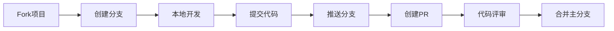
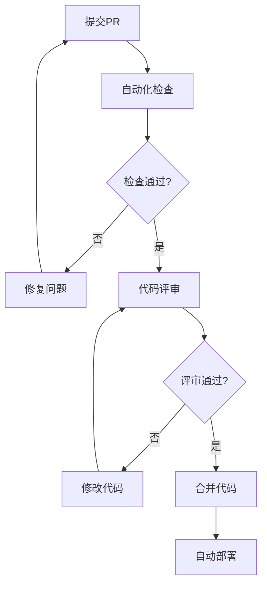
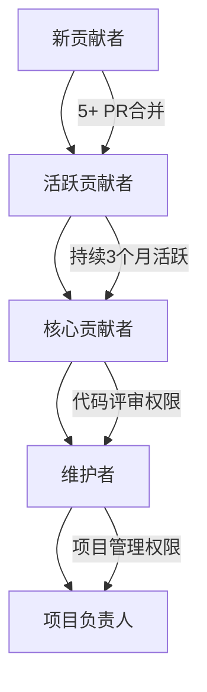

# 🤝 Domain-MAX 贡献指南

感谢您对 Domain-MAX 项目的关注！本指南将帮助您了解如何参与项目贡献，包括代码贡献、文档改进、问题反馈等。

> 📖 **文档导航**：[项目概述](./README.md) → [部署指南](./DEPLOYMENT.md) → [操作手册](./OPERATIONS.md) → **贡献指南**

---

## 🌟 贡献方式

我们欢迎各种形式的贡献：

| 贡献类型          | 难度等级   | 时间投入   | 影响范围 | 入门推荐     |
| ----------------- | ---------- | ---------- | -------- | ------------ |
| **🐛 Bug 反馈**   | ⭐         | 5-15 分钟  | 项目质量 | ✅ 新手友好  |
| **📝 文档改进**   | ⭐⭐       | 30-60 分钟 | 用户体验 | ✅ 新手友好  |
| **🎨 UI/UX 优化** | ⭐⭐⭐     | 2-8 小时   | 用户体验 | 前端开发者   |
| **🔧 功能开发**   | ⭐⭐⭐⭐   | 1-7 天     | 功能增强 | 有经验开发者 |
| **🏗️ 架构改进**   | ⭐⭐⭐⭐⭐ | 1-4 周     | 系统架构 | 资深开发者   |

---

## 🚀 快速开始贡献

### 第一次贡献（5 分钟）

1. **⭐ Star 项目**：给项目点个 Star 支持我们
2. **📢 分享项目**：分享给可能需要的朋友或同事
3. **📝 反馈使用体验**：在 [Discussions](https://github.com/Domain-MAX/Domain-MAX/discussions) 分享使用感受

### 简单贡献（30 分钟）

1. **🐛 报告 Bug**：发现问题时提交 [Issue](https://github.com/Domain-MAX/Domain-MAX/issues)
2. **📖 改进文档**：修正文档中的错误或改进表述
3. **🌐 翻译文档**：帮助翻译文档为其他语言

### 深度贡献（数小时-数天）

1. **💻 代码贡献**：实现新功能或修复 Bug
2. **🎨 界面设计**：改进用户界面和交互体验
3. **🧪 测试用例**：编写单元测试和集成测试
4. **📦 新功能开发**：开发新的 DNS 服务商支持等

---

## 💻 开发环境搭建

### 环境要求

| 工具         | 版本要求 | 安装方式                           | 验证命令           |
| ------------ | -------- | ---------------------------------- | ------------------ |
| **Go**       | 1.23+    | [官方下载](https://golang.org/dl/) | `go version`       |
| **Node.js**  | 18.0+    | [官方下载](https://nodejs.org/)    | `node --version`   |
| **Git**      | 2.30+    | [官方下载](https://git-scm.com/)   | `git --version`    |
| **Docker**   | 20.10+   | [官方下载](https://docker.com/)    | `docker --version` |
| **IDE 推荐** | -        | VS Code / GoLand                   | -                  |

### 开发环境设置

1. **克隆仓库**

   ```bash
   # Fork项目到您的GitHub账号
   # 然后克隆您的Fork
   git clone https://github.com/YOUR_USERNAME/Domain-MAX.git
   cd Domain-MAX

   # 添加上游仓库
   git remote add upstream https://github.com/Domain-MAX/Domain-MAX.git
   ```

2. **安装依赖**

   ```bash
   # 安装Go依赖
   go mod download

   # 安装前端依赖
   cd frontend
   npm install
   cd ..
   ```

3. **配置开发环境**

   ```bash
   # 创建开发配置
   cp env.example .env

   # 生成开发用的安全配置
   go run scripts/generate_config.go --dev

   # 启动开发数据库（可选）
   docker-compose up -d db
   ```

4. **启动开发服务**

   ```bash
   # 终端1：启动后端开发服务
   go run main.go

   # 终端2：启动前端开发服务
   cd frontend && npm run dev
   ```

5. **验证开发环境**
   - 后端：http://localhost:8080/api/health
   - 前端：http://localhost:5173
   - API 文档：http://localhost:8080/api/docs

---

## 🛠️ 代码贡献流程

### Git 工作流

我们使用标准的 GitHub Flow：



### 分支命名规范

```bash
# 功能开发
feature/user-authentication
feature/dns-provider-aliyun

# Bug修复
bugfix/login-error
bugfix/dns-sync-failure

# 热修复
hotfix/security-vulnerability
hotfix/critical-data-loss

# 文档改进
docs/api-documentation
docs/deployment-guide

# 重构
refactor/auth-middleware
refactor/database-layer
```

### 提交消息规范

使用 [Conventional Commits](https://www.conventionalcommits.org/) 规范：

```bash
# 功能新增
feat(dns): 添加阿里云DNS服务商支持
feat(ui): 新增暗黑模式主题

# Bug修复
fix(auth): 修复JWT令牌过期处理逻辑
fix(ui): 修复移动端布局问题

# 文档更新
docs(readme): 更新快速开始指南
docs(api): 完善DNS记录API文档

# 重构
refactor(middleware): 简化认证中间件结构
refactor(utils): 优化配置验证函数

# 测试
test(auth): 添加用户认证单元测试
test(dns): 添加DNS记录集成测试

# 构建/工具
chore(docker): 优化Docker镜像构建
chore(deps): 更新Go依赖版本
```

---

## 📝 代码规范

### Go 代码规范

1. **包和文件命名**

   ```go
   // ✅ 正确
   package middleware  // 全小写
   // middleware.go     // 文件名全小写下划线分隔

   // ❌ 错误
   package MiddleWare  // 混合大小写
   // middlewareAuth.go // 驼峰命名
   ```

2. **函数和变量命名**

   ```go
   // ✅ 公开函数：大驼峰
   func CreateDNSRecord() {}

   // ✅ 私有函数：小驼峰
   func validateRecordParams() {}

   // ✅ 常量：全大写下划线
   const MAX_DNS_RECORDS = 1000

   // ✅ 变量：小驼峰
   var dnsProvider DNSProvider
   ```

3. **注释规范**

   ```go
   // Package providers 实现各种DNS服务商的接口适配
   package providers

   // DNSProvider 定义DNS服务商必须实现的接口
   //
   // 该接口封装了不同DNS服务商API的差异，提供统一的操作方法。
   // 目前支持DNSPod传统API和v3.0 API。
   type DNSProvider interface {
       // CreateRecord 创建DNS记录
       //
       // 参数说明：
       //   domain: 主域名，如 "example.com"
       //   subdomain: 子域名，如 "www"
       //   recordType: 记录类型，如 "A", "CNAME"
       //   value: 记录值，如 IP地址或目标域名
       //   ttl: 生存时间，单位秒，范围1-604800
       //
       // 返回值：
       //   string: DNS服务商返回的记录ID
       //   error: 创建失败时返回错误信息
       CreateRecord(domain, subdomain, recordType, value string, ttl int) (string, error)
   }
   ```

4. **错误处理**

   ```go
   // ✅ 详细的错误处理
   func CreateRecord(params RecordParams) (*Record, error) {
       // 参数验证
       if err := validateParams(params); err != nil {
           return nil, fmt.Errorf("参数验证失败: %w", err)
       }

       // API调用
       record, err := provider.CreateRecord(params)
       if err != nil {
           return nil, fmt.Errorf("DNS服务商API调用失败: %w", err)
       }

       return record, nil
   }
   ```

### TypeScript 代码规范

1. **组件命名**

   ```typescript
   // ✅ 组件：大驼峰
   const DNSRecordsTable: React.FC = () => {};

   // ✅ 接口：大驼峰，I开头
   interface IDNSRecord {
     id: number;
     subdomain: string;
   }

   // ✅ 类型：大驼峰
   type RecordType = "A" | "CNAME" | "TXT" | "MX";
   ```

2. **Hooks 和工具函数**

   ```typescript
   // ✅ 自定义Hook：use开头
   const useDNSRecords = () => {};

   // ✅ 工具函数：小驼峰
   const validateEmailFormat = (email: string) => {};

   // ✅ 常量：全大写下划线
   const MAX_RECORDS_PER_PAGE = 20;
   ```

3. **API 调用规范**
   ```typescript
   // ✅ 统一的错误处理
   const api = {
     async createRecord(data: CreateRecordRequest): Promise<DNSRecord> {
       try {
         const response = await axios.post("/api/dns-records", data);
         return response.data.record;
       } catch (error) {
         if (axios.isAxiosError(error)) {
           throw new Error(error.response?.data?.error || "创建记录失败");
         }
         throw error;
       }
     },
   };
   ```

---

## 🧪 测试指南

### 测试策略

| 测试类型     | 覆盖范围     | 工具                | 目标覆盖率    |
| ------------ | ------------ | ------------------- | ------------- |
| **单元测试** | 核心业务逻辑 | Go testing + Jest   | > 80%         |
| **集成测试** | API 接口     | Testify + Supertest | > 70%         |
| **E2E 测试** | 用户流程     | Playwright          | 关键流程 100% |
| **性能测试** | 系统负载     | Artillery.js        | 基准测试      |

### Go 后端测试

1. **测试文件组织**

   ```
   internal/
   ├── services/
   │   ├── auth.go
   │   ├── auth_test.go        # 单元测试
   │   └── auth_integration_test.go  # 集成测试
   ```

2. **单元测试示例**

   ```go
   func TestUserRegistration(t *testing.T) {
       tests := []struct {
           name    string
           req     models.RegisterRequest
           wantErr bool
           errMsg  string
       }{
           {
               name: "valid registration",
               req: models.RegisterRequest{
                   Email:           "test@example.com",
                   Password:        "SecurePassword123!",
                   ConfirmPassword: "SecurePassword123!",
                   Nickname:        "TestUser",
               },
               wantErr: false,
           },
           {
               name: "weak password",
               req: models.RegisterRequest{
                   Email:           "test@example.com",
                   Password:        "123456",
                   ConfirmPassword: "123456",
               },
               wantErr: true,
               errMsg:  "密码强度不够",
           },
       }

       for _, tt := range tests {
           t.Run(tt.name, func(t *testing.T) {
               err := tt.req.Validate()
               if (err != nil) != tt.wantErr {
                   t.Errorf("Validate() error = %v, wantErr %v", err, tt.wantErr)
               }
               if tt.wantErr && !strings.Contains(err.Error(), tt.errMsg) {
                   t.Errorf("Expected error message containing '%s', got '%s'", tt.errMsg, err.Error())
               }
           })
       }
   }
   ```

3. **运行测试**

   ```bash
   # 运行所有测试
   go test ./...

   # 运行特定包的测试
   go test ./internal/services

   # 查看测试覆盖率
   go test -cover ./...
   go test -coverprofile=coverage.out ./...
   go tool cover -html=coverage.out
   ```

### React 前端测试

1. **测试工具配置**

   ```json
   // package.json
   {
     "scripts": {
       "test": "vitest",
       "test:ui": "vitest --ui",
       "test:coverage": "vitest --coverage"
     },
     "devDependencies": {
       "@testing-library/react": "^13.0.0",
       "@testing-library/jest-dom": "^5.16.0",
       "@testing-library/user-event": "^14.0.0",
       "vitest": "^0.34.0"
     }
   }
   ```

2. **组件测试示例**

   ```typescript
   import { render, screen, fireEvent, waitFor } from "@testing-library/react";
   import userEvent from "@testing-library/user-event";
   import { vi } from "vitest";
   import Login from "../pages/Login";

   describe("Login Component", () => {
     it("should handle user login successfully", async () => {
       const user = userEvent.setup();

       render(<Login />);

       // 填写登录表单
       await user.type(screen.getByLabelText(/邮箱/i), "test@example.com");
       await user.type(screen.getByLabelText(/密码/i), "password123");

       // 提交表单
       await user.click(screen.getByRole("button", { name: /登录/i }));

       // 验证结果
       await waitFor(() => {
         expect(screen.getByText(/登录成功/i)).toBeInTheDocument();
       });
     });

     it("should show error for invalid credentials", async () => {
       const user = userEvent.setup();

       // Mock API失败响应
       vi.mocked(api.post).mockRejectedValue({
         response: { data: { error: "邮箱或密码错误" } },
       });

       render(<Login />);

       await user.type(screen.getByLabelText(/邮箱/i), "invalid@example.com");
       await user.type(screen.getByLabelText(/密码/i), "wrongpassword");
       await user.click(screen.getByRole("button", { name: /登录/i }));

       await waitFor(() => {
         expect(screen.getByText(/邮箱或密码错误/i)).toBeInTheDocument();
       });
     });
   });
   ```

---

## 🎯 贡献重点领域

### 🚨 急需贡献的领域

1. **🌍 DNS 服务商支持**

   - **阿里云 DNS**：实现 v3.0 API 适配器
   - **Cloudflare**：实现 v4.0 API 适配器
   - **华为云 DNS**：新增服务商支持
   - **难度**：⭐⭐⭐⭐ | **影响**：功能扩展 | **时间**：1-2 周

2. **🌐 国际化支持**

   - **英文界面**：翻译所有前端文本
   - **多语言框架**：实现 i18n 基础设施
   - **文档翻译**：英文版文档
   - **难度**：⭐⭐⭐ | **影响**：用户体验 | **时间**：3-5 天

3. **📱 移动端优化**
   - **响应式改进**：优化移动端布局
   - **PWA 支持**：渐进式 Web 应用特性
   - **触控交互**：改进触摸屏操作体验
   - **难度**：⭐⭐⭐ | **影响**：用户体验 | **时间**：1-2 周

### 🎨 用户体验改进

1. **界面优化**

   - 暗黑模式主题
   - 自定义主题配色
   - 动画和过渡效果
   - 无障碍访问支持

2. **功能增强**
   - 批量 DNS 记录操作
   - DNS 记录模板系统
   - 操作历史记录
   - 数据导入导出

### 🔧 技术债务

1. **代码质量**

   - 单元测试覆盖率提升
   - 代码重构和优化
   - 性能瓶颈优化
   - 错误处理改进

2. **安全加固**
   - 安全漏洞修复
   - 权限控制细化
   - 审计日志完善
   - 数据脱敏处理

---

## 📋 Pull Request 指南

### 提交前检查清单

#### 代码质量检查

- [ ] **格式化**：代码已格式化（`gofmt`, `prettier`）
- [ ] **Lint 检查**：无 Lint 错误
- [ ] **编译测试**：代码可正常编译
- [ ] **功能测试**：新功能已手动测试

#### 测试要求

- [ ] **单元测试**：新代码有对应的单元测试
- [ ] **测试通过**：所有测试用例通过
- [ ] **覆盖率**：测试覆盖率不低于现有水平
- [ ] **集成测试**：API 变更有对应集成测试

#### 文档要求

- [ ] **代码注释**：复杂逻辑有清晰注释
- [ ] **API 文档**：新 API 有完整文档说明
- [ ] **用户文档**：用户可见功能更新了操作手册
- [ ] **变更日志**：重要变更记录在 CHANGELOG.md

### PR 模板

```markdown
## 📝 变更说明

### 🎯 变更类型

- [ ] ✨ 新功能
- [ ] 🐛 Bug 修复
- [ ] 📝 文档更新
- [ ] 🎨 界面优化
- [ ] ⚡ 性能优化
- [ ] 🔧 重构
- [ ] 🧪 测试

### 📋 变更内容

**简要描述：**
[简短描述此次变更的主要内容]

**详细说明：**
[详细描述实现方案、技术细节等]

**影响范围：**
[说明变更影响的模块和功能]

### 🧪 测试情况

**测试用例：**

- [ ] 单元测试：新增 X 个，修改 Y 个
- [ ] 集成测试：覆盖主要业务流程
- [ ] 手动测试：已验证关键功能

**测试环境：**

- 操作系统：Ubuntu 22.04
- Go 版本：1.23.0
- Node.js 版本：18.17.0
- 数据库：PostgreSQL 15

### 📸 截图/演示

[如果是 UI 变更，请提供 before/after 截图]

### 🔗 相关 Issue

Closes #123
Relates to #456

### 👥 Reviewer

@reviewer-username

### 📋 检查清单

- [ ] 代码已自测通过
- [ ] 已添加必要的测试用例
- [ ] 已更新相关文档
- [ ] 遵循项目代码规范
- [ ] 无明显性能问题
```

### 代码评审标准

#### 评审重点

1. **功能正确性**

   - 是否实现了预期功能
   - 边界情况处理是否完善
   - 错误处理是否合理

2. **代码质量**

   - 代码结构是否清晰
   - 命名是否有意义
   - 是否有重复代码

3. **安全性**

   - 输入验证是否完整
   - 权限检查是否到位
   - 敏感信息处理是否安全

4. **性能影响**
   - 是否存在性能瓶颈
   - 数据库查询是否优化
   - 内存使用是否合理

#### 评审流程



---

## 🏆 贡献者激励

### 贡献者认可

1. **贡献者墙**

   - 项目 README 中展示贡献者头像
   - 按贡献类型和数量排序
   - 链接到贡献者的 GitHub Profile

2. **特殊标识**

   - **Core Contributor**：持续贡献的核心开发者
   - **Documentation Master**：文档贡献专家
   - **Bug Hunter**：Bug 发现和修复专家
   - **Feature Architect**：功能设计和架构专家

3. **成就系统**
   - 🥇 **首次贡献**：提交第一个被合并的 PR
   - 🐛 **Bug 终结者**：修复 10 个 Bug
   - 📝 **文档大师**：贡献 100+行文档
   - 🏗️ **架构师**：重要架构设计贡献

---

## 📞 贡献者支持

### 沟通渠道

| 渠道类型               | 地址                                                           | 用途               | 活跃时间 |
| ---------------------- | -------------------------------------------------------------- | ------------------ | -------- |
| **Discord 社区**       | [加入 Discord](https://discord.gg/n4AdZGwy5K)                  | 实时技术交流讨论   | 24/7     |
| **GitHub Discussions** | [讨论区](https://github.com/Domain-MAX/Domain-MAX/discussions) | 功能讨论、技术交流 | 24/7     |
| **GitHub Issues**      | [问题反馈](https://github.com/Domain-MAX/Domain-MAX/issues)    | Bug 报告、功能建议 | 24/7     |

---

## 🎓 学习资源

### 技术学习

**Go 语言**：

- [Go 官方教程](https://tour.golang.org/)
- [Effective Go](https://golang.org/doc/effective_go.html)
- [Go 语言圣经](https://books.studygolang.com/gopl-zh/)

**React 生态**：

- [React 官方文档](https://react.dev/)
- [TypeScript 手册](https://www.typescriptlang.org/docs/)
- [Ant Design 组件库](https://ant.design/)

**DevOps 工具**：

- [Docker 官方文档](https://docs.docker.com/)
- [PostgreSQL 文档](https://www.postgresql.org/docs/)
- [Nginx 配置指南](http://nginx.org/en/docs/)

### 项目特定知识

**DNS 技术**：

- [DNS 记录类型详解](https://www.cloudflare.com/learning/dns/dns-records/)
- [DNSPod API 文档](https://docs.dnspod.cn/)
- [腾讯云 DNS 文档](https://cloud.tencent.com/document/product/302)

**安全实践**：

- [OWASP 安全指南](https://owasp.org/www-project-top-ten/)
- [JWT 安全最佳实践](https://tools.ietf.org/html/rfc8725)
- [Web 安全防护](https://infosec.mozilla.org/guidelines/web_security)

---

## 🚀 成为核心贡献者

### 晋升路径



### 责任和权限

| 级别           | 权限           | 责任         | 要求                |
| -------------- | -------------- | ------------ | ------------------- |
| **活跃贡献者** | Issue 标签管理 | 帮助新贡献者 | 5+ PR 被合并        |
| **核心贡献者** | PR 审核权限    | 代码质量把关 | 持续 3 个月活跃贡献 |
| **维护者**     | 分支管理权限   | 发布版本管理 | 技术领导能力        |
| **项目负责人** | 完整管理权限   | 项目方向决策 | 团队认可度          |

### 申请流程

1. **提名自己或他人**

   - 在 Discussions 发起提名帖
   - 说明贡献历史和技能
   - 获得现有核心贡献者支持

2. **权限授予**
   - GitHub 权限配置
   - 代码评审和管理培训

---

<div align="center">

## 🎉 加入 Domain-MAX 贡献者大家庭！

**无论您的技术水平如何，都有适合的贡献方式。**

**从小做起，从今天开始！**

[🏠 项目首页](./README.md) | [🚀 快速部署](./DEPLOYMENT.md) | [📋 使用指南](./OPERATIONS.md)

Made with ❤️ by Domain-MAX Team

</div>
