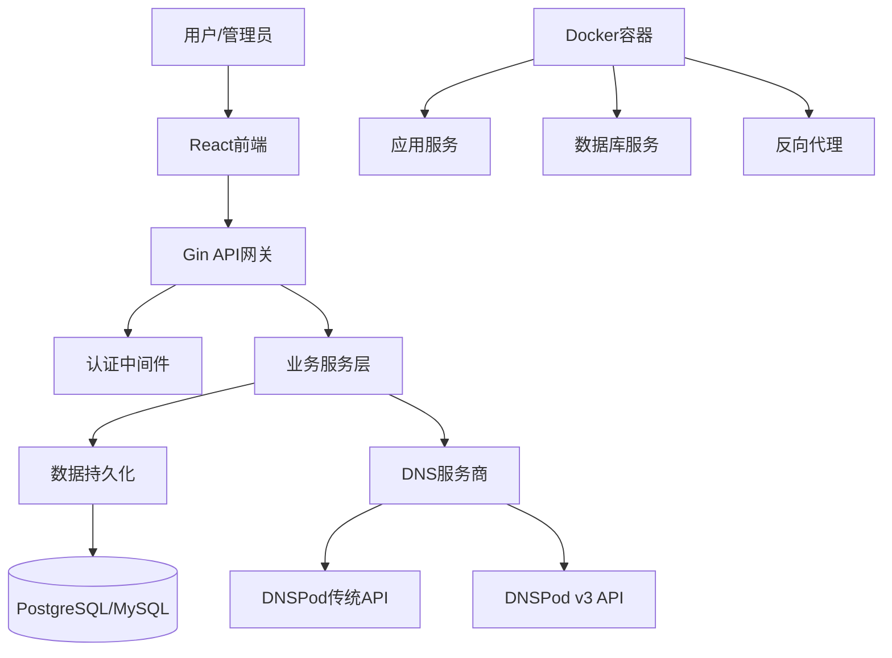

# Domain-MAX - 现代化域名与 DNS 记录管理系统

[](https://golang.org/)
[](https://reactjs.org/)
[](LICENSE)
[](https://hub.docker.com/)

**Domain-MAX** 是一款专为现代化 DNS 管理设计的开源系统，采用前后端分离架构，为个人用户和管理员提供强大、安全、易用的域名与 DNS 记录管理功能。

---

## 🌟 系统特性

<table width="100%">
  <tr>
    <td width="50%" valign="top">
      <h3>👤 用户端功能</h3>
      <ul>
        <li><strong>✅ 完整用户体系</strong> - 注册、登录、邮箱验证、密码重置</li>
        <li><strong>✅ DNS记录管理</strong> - 支持A、CNAME、TXT、MX记录的增删改查</li>
        <li><strong>✅ 多域名支持</strong> - 使用管理员配置的多个可用域名</li>
        <li><strong>✅ 实时DNS同步</strong> - 记录变更自动同步至DNS服务商</li>
        <li><strong>✅ 现代化界面</strong> - 基于Ant Design的响应式设计</li>
        <li><strong>✅ 安全防护</strong> - JWT认证、CSRF保护、速率限制</li>
      </ul>
    </td>
    <td width="50%" valign="top">
      <h3>🛡️ 管理端功能</h3>
      <ul>
        <li><strong>✅ 用户管理</strong> - 用户查看、编辑、禁用等完整操作</li>
        <li><strong>✅ 域名资源管理</strong> - 添加、删除、同步可用域名</li>
        <li><strong>✅ DNS服务商配置</strong> - 支持DNSPod传统API和v3.0 API</li>
        <li><strong>✅ SMTP邮件配置</strong> - 灵活的邮件服务器配置管理</li>
        <li><strong>✅ 系统监控</strong> - 实时统计数据和运行状态监控</li>
        <li><strong>✅ 安全管控</strong> - 管理员权限控制和操作审计</li>
      </ul>
    </td>
  </tr>
</table>

---

## 🚀 快速开始

### 方式一：Docker 一键部署（推荐）

**3 分钟快速体验完整功能！**

```bash
# 1. 获取项目代码
git clone https://github.com/Domain-MAX/Domain-MAX.git
cd Domain-MAX

# 2. 生成安全配置
go run scripts/generate_config.go

# 3. 一键启动服务
docker-compose up -d
```

**🎉 立即访问：**

- **用户门户**：http://localhost:8080
- **管理后台**：http://localhost:8080/admin

**默认管理员账号**：

- 邮箱：`admin@example.com`
- 密码：`admin123`

> ⚠️ **安全提醒**：首次登录后请立即修改默认密码！具体操作步骤请参考 [操作手册 - 账户管理](./OPERATIONS.md#账户管理)

### 方式二：源码部署

适合开发者和需要自定义部署的场景，详细步骤请参考 [部署指南 - 源码部署](./DEPLOYMENT.md#-源码部署)：

```bash
# 快速预览流程（完整流程见部署指南）
go mod tidy && go build -o domain-manager
cd frontend && npm install && npm run build && cd ..
cp env.example .env  # 详细配置说明见部署指南
./domain-manager
```

> 📖 **详细说明**：完整的源码部署流程、环境配置、依赖安装请查看 [DEPLOYMENT.md](./DEPLOYMENT.md)

---

## 📖 文档导航

| 文档类型        | 文档链接                                 | 适用对象         | 主要内容                                      | 使用场景           |
| --------------- | ---------------------------------------- | ---------------- | --------------------------------------------- | ------------------ |
| **🚀 部署指南** | **[DEPLOYMENT.md](./DEPLOYMENT.md)**     | 运维人员、开发者 | Docker 部署、源码构建、生产环境配置、故障排除 | 系统安装和环境搭建 |
| **📋 操作手册** | **[OPERATIONS.md](./OPERATIONS.md)**     | 用户、管理员     | 功能使用说明、管理指南、安全最佳实践          | 日常使用和系统管理 |
| **🔧 开发指南** | **[CONTRIBUTING.md](./CONTRIBUTING.md)** | 开发者           | 代码规范、开发环境、贡献流程                  | 二次开发和贡献代码 |

### 📚 文档使用建议

- **🆕 首次使用**：README.md → DEPLOYMENT.md → OPERATIONS.md
- **🔧 问题排查**：OPERATIONS.md 故障排除 → DEPLOYMENT.md 环境诊断
- **🚀 生产部署**：DEPLOYMENT.md 生产环境部署 → OPERATIONS.md 安全配置

---

## 🏗️ 系统架构

### 技术栈概览

| 分类         | 技术选型                  | 版本要求    | 说明             |
| ------------ | ------------------------- | ----------- | ---------------- |
| **后端**     | Go + Gin                  | Go 1.23+    | 高性能 API 服务  |
| **前端**     | React + TypeScript + Vite | Node.js 18+ | 现代化单页应用   |
| **数据库**   | PostgreSQL / MySQL        | 13+ / 8.0+  | 双数据库支持     |
| **UI 框架**  | Ant Design                | 5.8+        | 企业级 UI 组件库 |
| **状态管理** | Zustand                   | 4.4+        | 轻量级状态管理   |
| **容器化**   | Docker + Docker Compose   | -           | 一键部署方案     |

### DNS 服务商支持

| 服务商            | 状态        | API 版本        | 支持记录类型               | 配置说明                         |
| ----------------- | ----------- | --------------- | -------------------------- | -------------------------------- |
| **腾讯云 DNSPod** | ✅ 完整支持 | 传统 API + v3.0 | A, CNAME, TXT, MX, NS, SRV | 传统 Token 或 SecretId/SecretKey |
| **阿里云 DNS**    | 🔄 开发中   | v3.0            | A, CNAME, TXT, MX          | 计划下个版本支持                 |
| **Cloudflare**    | 📋 计划中   | v4.0            | 全记录类型                 | 未来规划支持                     |

### 核心架构



---

## 📊 功能特性详解

### 🔐 安全特性

- **多重认证防护**：JWT + HttpOnly Cookie + CSRF Token
- **数据加密存储**：敏感信息 AES-256 加密
- **速率限制**：防暴力破解和 API 滥用
- **输入验证**：全面的参数验证和 SQL 注入防护
- **权限控制**：基于角色的访问控制（RBAC）
- **安全响应头**：完整的 HTTP 安全头设置

### 🎯 DNS 管理能力

- **记录类型支持**：A、CNAME、TXT、MX、NS、SRV 记录
- **批量操作**：支持批量创建、修改、删除 DNS 记录
- **TTL 管理**：灵活的 TTL 设置（1 秒-7 天）
- **记录验证**：创建前自动验证记录格式和值
- **实时同步**：变更立即同步至 DNS 服务商
- **操作审计**：完整的操作日志记录

### 📱 用户体验

- **响应式设计**：完美支持桌面端和移动端
- **暗黑模式**：系统级暗黑模式支持
- **国际化**：多语言支持框架（当前支持中文）
- **无障碍访问**：遵循 WCAG 2.1 AA 标准
- **性能优化**：代码分割、懒加载、CDN 加速

---

## 🔧 开发与贡献

### 开发环境搭建

```bash
# 1. 克隆仓库
git clone https://github.com/Domain-MAX/Domain-MAX.git
cd Domain-MAX

# 2. 安装后端依赖
go mod download

# 3. 安装前端依赖
cd frontend && npm install && cd ..

# 4. 启动开发环境
# 后端（端口8080）
go run main.go

# 前端（端口5173）
cd frontend && npm run dev
```

### 项目结构

```
Domain-MAX/
├── 📁 internal/              # Go后端核心代码
│   ├── api/                  # API路由和处理器
│   ├── config/               # 配置管理
│   ├── middleware/           # 中间件（认证、CORS、限流）
│   ├── models/               # 数据模型和验证
│   ├── services/             # 业务逻辑层
│   ├── providers/            # DNS服务商适配器
│   └── utils/                # 工具函数
├── 📁 frontend/              # React前端应用
│   ├── src/components/       # 通用组件
│   ├── src/pages/            # 页面组件
│   ├── src/stores/           # 状态管理
│   └── src/utils/            # 前端工具
├── 📁 scripts/               # 部署和维护脚本
├── 📄 docker-compose.yml    # Docker编排文件
├── 📄 Dockerfile           # 容器构建文件
└── 📋 docs/                 # 项目文档
```

### 贡献指南

欢迎参与项目贡献！请查看 [CONTRIBUTING.md](./CONTRIBUTING.md) 了解：

- 🐛 **Bug 报告**：详细的问题描述模板
- 💡 **功能建议**：新功能需求提交流程
- 🔧 **代码贡献**：Pull Request 规范和代码风格
- 📝 **文档改进**：文档贡献指南

---

## 📈 项目发展

### 当前版本状态

| 模块          | 完成度   | 状态               | 说明                     |
| ------------- | -------- | ------------------ | ------------------------ |
| 🔐 用户认证   | **100%** | ✅ 生产就绪        | 完整的认证流程和安全防护 |
| 📝 DNS 管理   | **100%** | ✅ 生产就绪        | 支持主流 DNS 记录类型    |
| 👥 用户管理   | **100%** | ✅ 生产就绪        | 完整的用户生命周期管理   |
| 🌐 域名管理   | **100%** | ✅ 生产就绪        | 域名资源的增删改查       |
| 🔌 DNS 服务商 | **90%**  | 🚀 DNSPod 完整支持 | 其他服务商开发中         |
| 📧 邮件服务   | **100%** | ✅ 生产就绪        | 灵活的 SMTP 配置         |
| 🎨 前端界面   | **100%** | ✅ 生产就绪        | 现代化响应式界面         |
| 🐳 容器部署   | **100%** | ✅ 生产就绪        | Docker 一键部署          |

**🎯 总体完成度：98%** - 已可用于生产环境

### 发展路线图

#### 🔄 v1.1 - 功能增强（开发中）

- [ ] 🌍 **更多 DNS 服务商**：阿里云 DNS、Cloudflare
- [ ] 📊 **增强统计**：详细的使用统计和图表
- [ ] 🔍 **搜索优化**：全局搜索和高级过滤
- [ ] 📱 **移动端优化**：PWA 支持和移动端适配
- [ ] 🌐 **多语言**：英文界面和国际化

#### 🚀 v1.2 - 企业级功能（规划中）

- [ ] 👥 **多租户**：组织和团队管理
- [ ] 🔐 **SSO 集成**：LDAP、OAuth2.0 支持
- [ ] 📋 **审计日志**：完整的操作审计系统
- [ ] 🔔 **监控告警**：DNS 记录状态监控
- [ ] 🔄 **批量导入**：DNS 记录批量导入导出

#### 💡 v2.0 - 平台化（远期规划）

- [ ] 🎯 **插件系统**：第三方插件开发框架
- [ ] 🤖 **AI 助手**：智能 DNS 配置建议
- [ ] 🌊 **实时协作**：多用户实时编辑
- [ ] 📈 **性能分析**：DNS 解析性能监控

---

## 💬 获取支持

### 获取帮助

| 问题类型        | 建议途径                                                                   | 响应时间  |
| --------------- | -------------------------------------------------------------------------- | --------- |
| 🐛 **Bug 报告** | [GitHub Issues](https://github.com/Domain-MAX/Domain-MAX/issues)           | 24 小时内 |
| 💡 **功能建议** | [GitHub Discussions](https://github.com/Domain-MAX/Domain-MAX/discussions) | 48 小时内 |
| 💬 **实时交流** | [Discord 社区](https://discord.gg/n4AdZGwy5K)                              | 即时响应  |
| 📖 **使用问题** | 查看 [操作手册](./OPERATIONS.md)                                           | -         |
| 🚀 **部署问题** | 查看 [部署指南](./DEPLOYMENT.md)                                           | -         |

### 社区资源

- 💬 **Discord 社区**：[加入我们的 Discord](https://discord.gg/n4AdZGwy5K) - 实时技术交流
- 📚 **项目文档**：完整的技术文档和使用指南
- 🏷️ **版本发布**：[Release Notes](https://github.com/Domain-MAX/Domain-MAX/releases) - 版本更新记录

---

## 📄 开源协议

本项目采用 [MIT License](LICENSE) 开源协议：

```
MIT License - Copyright (c) 2025 Domain-MAX

✅ 商业使用    ✅ 修改代码    ✅ 分发软件    ✅ 私人使用
❌ 责任担保    ❌ 质量保证
```

---

## 🙏 致谢

### 核心技术

感谢以下开源项目为 Domain-MAX 提供强大支持：

- [Gin Web Framework](https://gin-gonic.com/) - 高性能 Go Web 框架
- [React](https://reactjs.org/) - 现代化前端框架
- [Ant Design](https://ant.design/) - 企业级 UI 设计语言
- [PostgreSQL](https://www.postgresql.org/) - 强大的开源数据库
- [Docker](https://www.docker.com/) - 应用容器化平台

### 贡献者

感谢所有为项目做出贡献的开发者们！

<a href="https://github.com/Domain-MAX/Domain-MAX/graphs/contributors">
  
</a>

---

## ⭐ Star History

如果这个项目对您有帮助，请不要忘记给我们一个 ⭐！

[](https://star-history.com/#Domain-MAX/Domain-MAX&Date)

---

<div align="center">

**🎉 立即开始您的域名管理之旅！**

[](./DEPLOYMENT.md#-docker-部署推荐)
[](./OPERATIONS.md)
[](https://discord.gg/n4AdZGwy5K)

Made with ❤️ by Domain-MAX Team

</div>
